<p align="center">
  
</p>

<p align="center">
  
  
  
  
  
</p>

<p align="center"><i>This project has been created as part of the 42 curriculum by maslan.</i></p>

<p align="center">
  <b>Sort a stack of integers using a limited set of stack operations,<br/>aiming for the smallest possible number of moves.</b>
</p>

<p align="center">
  <a href="#description">Description</a> ·
  <a href="#how-it-works">How it works</a> ·
  <a href="#instructions">Build &amp; run</a> ·
  <a href="#benchmarks">Benchmarks</a> ·
  <a href="#resources">Resources</a>
</p>

---

## Description

`push_swap` is a 42 school algorithm project. You're given a list of integers on the command line. Your program must print the **shortest sequence of stack operations** that, when applied to the input, sorts it in ascending order with the smallest value on top.

The catch: you don't move the values yourself — you only print operation names like `sa`, `pb`, `rra`. A separate checker program reads that list, applies it to the original input, and reports whether the result is sorted. So `push_swap` is one part **sorting algorithm** and one part **clean C engineering** (parser, memory hygiene, the Norm).

### Why the silly tagline?

The official subject opens with: *"Push_swap — because Swap_push doesn't feel as natural."* That's the joke baked into the banner above: a `sa` on the title itself, swapping `PUSH` and `SWAP` back and forth.

---

## The 11 operations

You can only ever touch the **top** of a stack. These are your tools:

<table>
<tr>
  <th colspan="2">Swap</th>
  <th colspan="2">Push</th>
  <th colspan="2">Rotate</th>
  <th colspan="2">Reverse rotate</th>
</tr>
<tr>
  <td><code>sa</code></td><td>swap top 2 of a</td>
  <td><code>pa</code></td><td>top of b → a</td>
  <td><code>ra</code></td><td>a's top → bottom</td>
  <td><code>rra</code></td><td>a's bottom → top</td>
</tr>
<tr>
  <td><code>sb</code></td><td>swap top 2 of b</td>
  <td><code>pb</code></td><td>top of a → b</td>
  <td><code>rb</code></td><td>b's top → bottom</td>
  <td><code>rrb</code></td><td>b's bottom → top</td>
</tr>
<tr>
  <td><code>ss</code></td><td>sa + sb at once</td>
  <td></td><td></td>
  <td><code>rr</code></td><td>ra + rb at once</td>
  <td><code>rrr</code></td><td>rra + rrb at once</td>
</tr>
</table>

> The combo operations (`ss`, `rr`, `rrr`) count as **one** operation, not two — they're a cost-saving when both stacks need the same move.

---

## How it works

### The data structure

Each stack is a singly linked list of `t_stack` nodes:

```c
typedef struct s_stack
{
    int             value;   // the raw integer the user passed
    int             index;   // its rank in sorted order (0 = smallest)
    struct s_stack *next;    // the node below
} t_stack;
```

The head of the list is the top of the stack. Linked lists are the right pick because every operation is cheap pointer-rewiring — no shifting of memory, no fixed-size limits, sizes change constantly during the sort.

After parsing, every node gets an **index** — its rank in sorted order. The sort algorithm then thinks in bounded integers `0..N-1` instead of raw values that might be near `INT_MAX`.

### The algorithm — chunk sort

- **2 or 3 numbers** — hard-coded (only a handful of cases)
- **4 or 5 numbers** — push the smallest 1-2 to b, sort the rest, push back
- **More than 5** — two-phase chunk sort:

<table>
<tr>
<td width="50%">

**Phase 1 — push everything to b, in chunks**

Split the indices `0..N-1` into chunks of size **K**.

For each chunk, rotate through `a`. Whenever the top of `a` belongs to the current chunk, `pb` it. When the pushed index is in the *lower half* of the chunk, also `rb` it to sink it deeper.

The result: stack `b` is roughly sorted **descending** — biggest values near the top.

</td>
<td width="50%">

**Phase 2 — pop everything back to a, max first**

While `b` is non-empty:
1. Find the position of the max value in `b`
2. Rotate `b` in the cheaper direction (`rb` vs `rrb`) to bring it to the top
3. `pa` it

Since the largest goes first, it lands at the bottom of `a`. The smallest goes last, landing on top. When `b` is empty, `a` is sorted ascending — no cleanup needed.

</td>
</tr>
</table>

**Chunk size tuning:** K = 16 for N ≤ 100, K = 80 for N > 100. Picked empirically to hit the benchmarks.

**Complexity:** worst case **O(N²)** in operations. We accept this because the metric being graded is the number of *operations printed*, which stays well within the benchmark limits.

---

## Instructions

### Build

```sh
make           # compile push_swap
make clean     # remove .o files
make fclean    # remove .o files and the binary
make re        # fclean + all
```

Compiles with `cc -Wall -Wextra -Werror`. No relinking. No external libraries beyond the allowed: `read`, `write`, `malloc`, `free`, `exit`.

### Run

```sh
$ ./push_swap 2 1 3 6 5 8
sa
pb
pb
pb
sa
pa
pa
pa
```

<details>
<summary><b>More examples — edge cases</b></summary>

```sh
$ ./push_swap "5 2 8 1"        # quoted string, single argument — works
$ ./push_swap                  # no args → no output, exit 0
$ ./push_swap 1 2 3            # already sorted → no output
$ ./push_swap 0 one 2 3        # bad input → "Error" to stderr
$ ./push_swap 1 2 1            # duplicate → "Error" to stderr
$ ./push_swap "" 1             # empty string → "Error" to stderr
$ ./push_swap 99999999999      # exceeds int range → "Error" to stderr
```

</details>

### Verify with the checker

```sh
ARG="4 67 3 87 23"
./push_swap $ARG | wc -l                  # number of ops produced
./push_swap $ARG | ./checker_linux $ARG   # prints OK or KO
```

---

## Benchmarks

Measured over 10 random trials with shuffled input:

<table>
<tr>
  <th>Input size</th>
  <th>Average ops</th>
  <th>Worst case</th>
  <th>Subject limit</th>
  <th>Result</th>
</tr>
<tr>
  <td>100 random numbers</td>
  <td><code>~660</code></td>
  <td><code>~691</code></td>
  <td><code>&lt; 700</code> (100% tier)</td>
  <td>✅</td>
</tr>
<tr>
  <td>500 random numbers</td>
  <td><code>~5950</code></td>
  <td><code>~6060</code></td>
  <td><code>&lt; 8500</code> (80% tier)</td>
  <td>✅</td>
</tr>
</table>

---

## File layout

```
pushswap/
├── Makefile
├── push_swap.h                    ← t_stack + every function prototype
├── main.c                         ← entry point
├── parser.c · parser_utils.c · ft_split.c
├── stack_utils.c · stack_utils2.c ← linked-list helpers
├── ops_swap.c                     ← sa, sb, ss
├── ops_push.c                     ← pa, pb
├── ops_rotate.c                   ← ra, rb, rr
├── ops_rev_rotate.c               ← rra, rrb, rrr
├── indexing.c                     ← assign each value its rank
├── sort_small.c                   ← hard-coded sorts (size 2-5)
└── sort_chunks.c                  ← the chunk algorithm for size > 5
```

---

## Resources

Classic references used while building this project:

- The official push_swap subject (v10.1) — the only source of truth.
- *Introduction to Algorithms* (Cormen, Leiserson, Rivest, Stein) — the chapters on stacks and on sorting complexity.
- 42 community write-ups on the chunk / Turk approach.
- The provided `checker_OS` binary — used for verification throughout development.

### How AI was used

AI was used as a study aid, not as a code generator:

- **Concept walk-throughs** — what each operation does, the difference between a linked-list stack and an array stack, complexity vocabulary, why the Norm rules exist.
- **Algorithm trade-off discussion** — comparing the simple max-first phase 2 against cost-based selection. I measured both against the checker myself and committed to the simpler one for defensibility.
- **Defense rehearsal** — practicing answers to the questions a peer evaluator is likely to ask.

Every function in this codebase was written and understood line-by-line. I can explain each one in plain words during the defense.

---

<p align="center">
  <sub>built for 42 · <a href="https://github.com/">github.com/maslan</a></sub>
</p>
